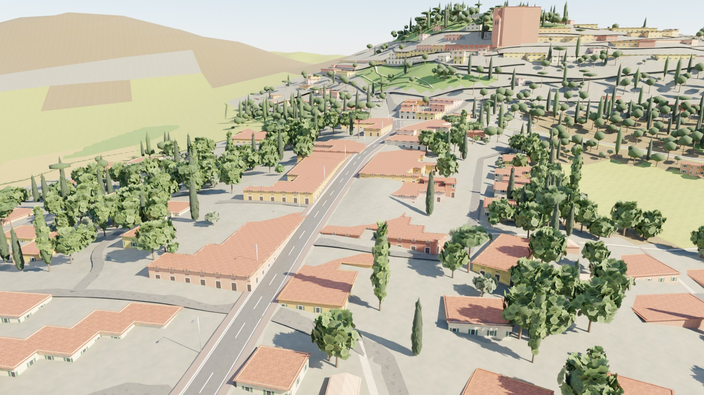

# Game-art path (Blender art kits → web client / Unreal)

`gpx2course game <package> [--kit emilia-romagna] [--render "name:km:mode[:back],…"]` turns a built course package into
a game-style level: textured terrain, roads and buildings, and instance lists for a regional **art kit** made in Blender.
It is an optional layer next to the quick/lite world and the photoreal (Google 3D Tiles) mode.

```
course package ──► gamekit/prep.py (numpy/shapely: all GIS)      ──► chunk specs (terrain lattice, road, side roads,
       │                                                              buildings, kit instances) per 500 m
       │          gamekit/build_kit.py (procedural textures)      ──► kit/textures, materials.json
       │          blender/game/build_kit_meshes.py (Blender)      ──► kit.glb, kit.blend, assets.json
       └────────► blender/game/bake_game_chunk.py (Blender, ×N)   ──► game/chunks/g<id>.glb (+ far.glb), meshopt
                  blender/game/render_course.py (Cycles)          ──► game/shots/*.jpg
```

## Data
- **Roads, buildings, water, land use**: Overture Maps (S3 GeoParquet, read with HTTP range requests and row-group
  bbox pruning — no OSM/Overpass access needed); OSM sidecar/pbf/Overpass still work and take precedence when present.
- **Terrain**: Copernicus GLO-30 DEM corridor rasters from the package, blended to the course road and capped under
  every road leg it lies beneath (switchbacks); materials per 6 m cell: water → land use → ESA WorldCover.
- **Sparse route files** (planner exports such as the IRONMAN 70.3 Emilia-Romagna GPX: 737 points over 90 km, gaps up
  to 1.5 km) are rebuilt on the road network before matching (`gpx2course/roadsnap.py`, HMM map matching).

## Kits
A kit is one JSON file (`gpx2course/gamekit/kits/<name>.json`): palette, materials (procedural generator + parameters,
tile size, roughness), land-use → terrain material rules, vegetation rules and road furniture. `emilia-romagna`:
stucco houses (ochre, cream, salmon, Pompeian red, yellow, rose) with green persiane and coppi roofs, brick churches with
campanili and case coloniche, stone pines in the Cervia pinewood and gardens, Lombardy poplars on canals and field edges,
cypresses at cemeteries and villas, olives above 60 m, Sangiovese vine rows along the real vineyard polygons, peach
orchards, hedgerows, reeds and flamingos at the Saline di Cervia, Italian delineators/guardrails/town signs, race
barriers at the start/finish. Textures are generated (tileable, deterministic) — no downloads, CC0.

## Engine contract
- Chunk glTFs carry **no images**; material names are kit material ids. Bind `game/kit/materials.json` textures with
  `repeat = 1 / tileM` (UVs are metres; 0–1 for leaf cards and the sign atlas).
- `g<id>.inst.json`: `{origin, instances: {asset: [[x, y, z, rotZ, scale], …]}}`, chunk-local ENU metres (Z up). Use
  `<asset>` within ~200 m and `<asset>__lod1` beyond (both nodes are in `kit.glb`). ENU → three.js `(x, z, −y)`,
  ENU → Unreal `(E·100, −N·100, U·100)`, yaw sign flips with the handedness change.
- Positions are quantised to ~1 cm by gltfpack (`-vp 16`), UVs stay float (`-vtf`).

## Measured (Emilia-Romagna 70.3, 90.5 km, 4 vCPU)
Kit 7 MB (textures) + 33 assets; 182 chunks; full game build 7.7 min including five 1600×900 Cycles shots.


