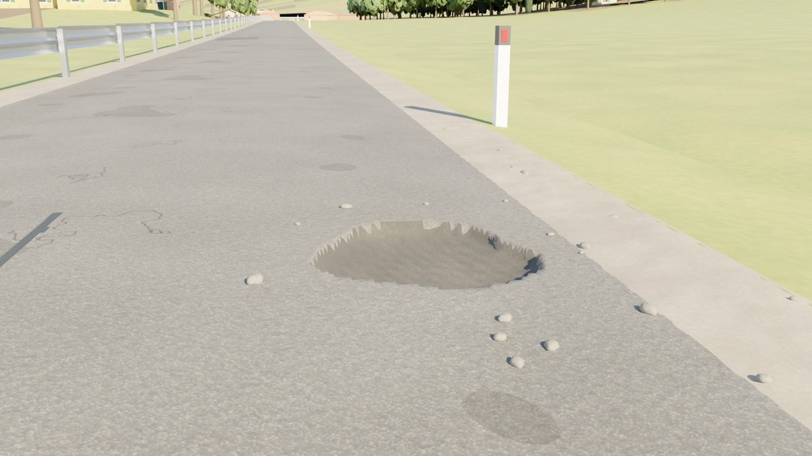
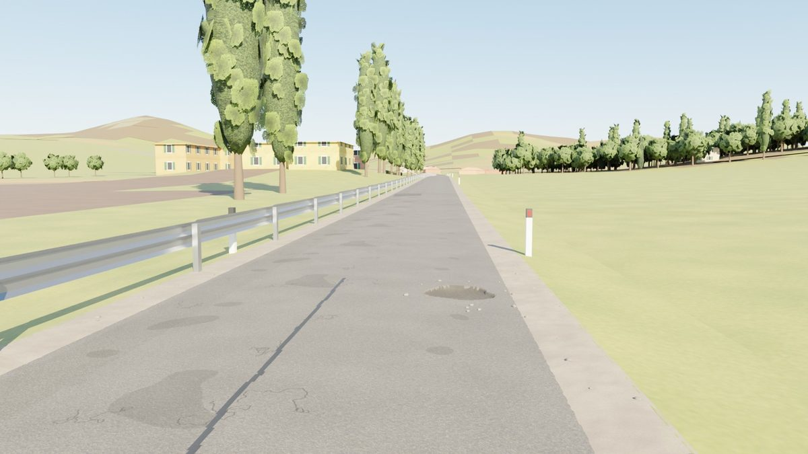

# Game-art path (Blender art kits → web client / Unreal)

`gpx2course game <package> [--kit emilia-romagna] [--render "name:km:mode[:back],…"]` turns a built course package into
a game-style level: textured terrain, roads and buildings, and instance lists for a regional **art kit** made in Blender.
It is an optional layer next to the quick/lite world and the photoreal (Google 3D Tiles) mode.

```
course package ──► gamekit/prep.py (numpy/shapely: all GIS)      ──► chunk specs (terrain lattice, road, side roads,
       │                                                              buildings, kit instances) per 500 m
       │          gamekit/build_kit.py (procedural textures)      ──► kit/textures, materials.json
       │          blender/game/build_kit_meshes.py (Blender)      ──► kit.glb, kit.blend, assets.json
       ├────────► blender/game/bake_game_chunk.py (Blender, ×N)   ──► game/chunks/g<id>.glb (+ far.glb), meshopt
       ├────────► blender/game/bake_hero_road.py (Blender, --hero) ──► game/unreal/hero/h<id>.glb (Nanite road)
                  blender/game/render_course.py (Cycles)          ──► game/shots/*.jpg
```

`gamekit/roadside.py` holds the roadside rules (the procedural "PCG" layer, evaluated once so every engine gets the
same world) and `blender/game/roadfx.py` turns its road defects into geometry for both bakes.

## Data
- **Roads, buildings, water, land use**: Overture Maps (S3 GeoParquet, read with HTTP range requests and row-group
  bbox pruning — no OSM/Overpass access needed); OSM sidecar/pbf/Overpass still work and take precedence when present.
- **Terrain**: Copernicus GLO-30 DEM corridor rasters from the package, blended to the course road and capped under
  every road leg it lies beneath (switchbacks); materials per 6 m cell: water → land use → ESA WorldCover.
- **Sparse route files** (planner exports such as the IRONMAN 70.3 Emilia-Romagna GPX: 737 points over 90 km, gaps up
  to 1.5 km) are rebuilt on the road network before matching (`gpx2course/roadsnap.py`, HMM map matching).

## Kits
A kit is one JSON file (`gpx2course/gamekit/kits/<name>.json`): palette, materials (procedural generator + parameters,
tile size, roughness), land-use → terrain material rules, vegetation rules and road furniture. `emilia-romagna`:
stucco houses (ochre, cream, salmon, Pompeian red, yellow, rose) with green persiane and coppi roofs, brick churches with
campanili and case coloniche, stone pines in the Cervia pinewood and gardens, Lombardy poplars on canals and field edges,
cypresses at cemeteries and villas, olives above 60 m, Sangiovese vine rows along the real vineyard polygons, peach
orchards, hedgerows, reeds and flamingos at the Saline di Cervia, Italian delineators/guardrails/town signs, race
barriers at the start/finish. Textures are generated (tileable, deterministic) — no downloads, CC0.

## Roadside rules and road surface
Kit `rules` (defaults in `gamekit/roadside.py`): trees ≥ `treeSetbackM` (5 m) from the course road **edge**, hedges ≥
1.5 m; gravel shoulders on rural roads without kerbs (0.5–1.0 m by road class), none on bridges or in towns; guardrail
runs where the ground drops ≥ 1.5 m within 4 m of the edge, on bridges, and along water within 4 m — evaluated on the
whole route (runs never break at chunk seams), gaps < 12 m closed, runs < 12 m dropped. Road defects per route sample
(hash-seeded, independent of chunking), densities per km by surface: potholes, repair patches (incl. trench patches),
bitumen-sealed and open cracks, transverse cracks, crumbled edges; none on porphyry setts or bridges. Emilia-Romagna:
3.7 km of guardrail in 61 runs; 137 potholes, 507 patches, ~1 500 cracks, 48 crumbled-edge stretches over 90 km.

- **Chunks** show defects as decals 2–3 mm above the road (`defects_<id>`, kit materials `asphalt_patch`, `pothole`,
  `tar_seal`, `gravel`), with polygon offset in the web client; road, markings, shoulders (`shoulder_gravel`) and verges
  are separate meshes, and neighbouring chunks meet at a shared sample with normals from the route heading (no
  overlap, no gap). The terrain carries a `RoadMask` vertex colour (1 at the verge → 0 four metres out).
- **Hero road** (`--hero all|84-92|km:44-46.5`, Unreal only): the carriageway as a lattice refined to ~3 × 1.5 cm around
  every defect, displaced into real potholes (steep ragged walls, rough floor), raised patches, crack grooves/seals and
  crumbled edges; markings are faces of the surface; gravel shoulders on a 5 cm lattice with stone relief tucked under
  the road edge and verge; loose stones (`h<id>_pebbles.json`, `pebbles.glb`). Chunk range exactly [sStart, sEnd] with
  the neighbours' defects included, so hero chunks join seamlessly. ~1 M triangles / 25–30 MB per 500 m.




## Engine contract
- Chunk glTFs carry **no images**; material names are kit material ids. Bind `game/kit/materials.json` textures with
  `repeat = 1 / tileM` (UVs are metres; 0–1 for leaf cards and the sign atlas).
- `g<id>.inst.json`: `{origin, instances: {asset: [[x, y, z, rotZ, scale], …]}}`, chunk-local ENU metres (Z up). Use
  `<asset>` within ~200 m and `<asset>__lod1` beyond (both nodes are in `kit.glb`). ENU → three.js `(x, z, −y)`,
  ENU → Unreal `(E·100, −N·100, U·100)`, yaw sign flips with the handedness change.
- Positions are quantised to ~1 cm by gltfpack (`-vp 16`), UVs stay float (`-vtf`).

## Clients
- **Web** (`apps/client/src/engine/GameWorld.ts`): used automatically when the package has `game/` (Settings → "Game
  art"; `?game=0` disables). Streams chunks spatially, InstancedMesh per kit asset with a 320 m LOD switch, far field with
  per-chunk corridor fills, sky/ground image-based light.
- **Unreal** (`apps/unreal/Scripts/import_game_level.py`): editor import into a World Partition level, see
  `apps/unreal/README.md`. Uses the uncompressed copies in `game/unreal/` and the land-use masks in `game/landuse/`.

## Measured (Emilia-Romagna 70.3, 90.5 km, 4 vCPU)
Kit 7 MB (textures) + 33 assets; 182 chunks; full game build 7.7 min including five 1600×900 Cycles shots.


