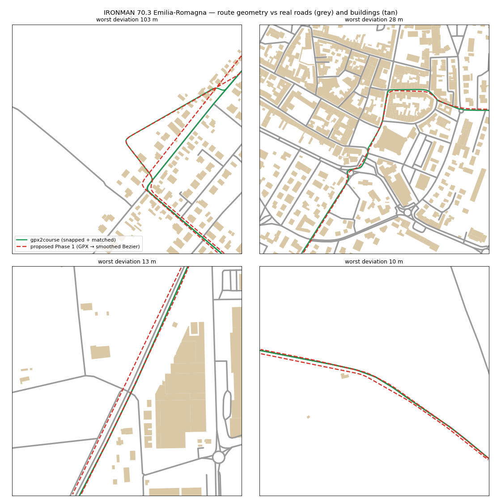

# Test: "GPX → Blender Geometry Nodes → UE5 PCG + Chaos" structure vs the current pipeline

Course: IRONMAN 70.3 Emilia-Romagna bike (official 2023 GPX, 737 points, 90 km). Same inputs for both:
Copernicus GLO-30 DEM (as the "local GeoTIFF" the proposal assumes) and Overture roads/buildings as the reference.

## What was run
| Phase | Run here? | How |
|---|---|---|
| 1 GPX → local metres → DEM Z → smoothed Bezier | yes | `phase1_gpx_to_curve.py` in headless Blender (bpy 5.0), as specified (no road network) |
| 2 Geometry Nodes road + superelevation + UCX + FBX | yes | `phase2_road_geonodes.py`: node groups built in Python, applied, exported to FBX |
| 3 UE5 Python import + PCG | no (no Unreal in this container) | assessed against the measured outputs |
| 4 Chaos two-wheeled vehicle + PID | no | assessed against the product requirements (power-based trainer sim) |

## Results
| Metric (official 90.0 km) | Proposed Phase 1 | gpx2course |
|---|---|---|
| Length | 89.29 km | 90.47 km |
| Distance to real road centreline: median / p95 | 2.0 m / 6.3 m | 0.0 m / 0.1 m |
| Share of route > 3 m off the centreline | 29.8 % | 0.7 % |
| Route > 10 m off the road | 1.54 km | 0.38 km (one GPX point 101 m from any mapped road; both keep it) |
| 5 m samples inside building footprints | 67 (≈ 0.34 km) | 8 |
| Ascent (GPX's own elevation: 270 m) | 342 m | 277 m |
| Max grade over 50 m | 17.8 % | 13.9 % |

Phase 2 (`results/phase2_metrics.json`): the full 90 km sweep evaluates in < 0.1 s (893 k triangles), FBX 21 MB in 1 s.
Superelevation at 60 km/h design speed, e_max 7 %: 23 % of the course banked > 2 %, 8.6 % at the cap.
Collision: per-segment boxes give 8 927 convex islands (valid UCX). The literal single convex hull is 7 km³ and a tyre
ray would hit it a median 25 m (max 111 m) above the road.



## Findings
1. **Phase 1 is better than expected on this file** (Openrunner puts its points on road vertices), but a straight
   GPX → Bezier still leaves the asphalt at ~30 % of the course (bends, roundabouts, old-town corners), runs through
   buildings in Forlimpopoli/Bertinoro, and DEM sampling at those cut corners (Copernicus is a surface model: roofs,
   trees, river banks under bridges) adds ~70 m of fake climbing and 18 % spikes. Device-recorded GPX (GPS drift 3–10 m)
   would be worse. Snapping to the real road network is what makes the geometry trustworthy.
2. **Phase 2's ideas are good, its collision spec is not.** Geometry Nodes is fast and artist-friendly, and
   **superelevation is a real gain** — the current pipeline exports `bankDeg = 0`. But: one convex hull of a road is
   physically wrong (measured above); "Use Complex Collision as Simple" in Phase 3 ignores UCX anyway; a constant 7 m
   profile loses real widths (4 m Bertinoro streets vs 7.5 m state roads); banking needs road-class/urban rules
   (Italian urban streets are not superelevated).
3. **Phase 3** — a single 90 km FBX at the origin defeats World Partition streaming/HLOD; there is **no terrain
   (Landscape) step and no road–terrain conformance**; and PCG "dense vegetation outside 5 m" with no land-use input
   yields a generic forest road — no vineyards, orchards, salt pans, field hedgerows, towns or buildings. UE PCG itself
   is the right tool for *dense detail* in Unreal (grass, shrubs, ground clutter, shoulder gravel).
4. **Phase 4** — for a training app the rider's speed must come from the trainer power through the validated physics
   model (spec §5 / §16 vectors). A Chaos raycast vehicle with a PID balance controller has its own dynamics (tyre
   friction, torque, instability) that fight that model; commercial cycling sims move the rider kinematically and lean
   it by `atan(v²/(g·R))`, which RidePrep already does. PhysMats are useful for *feedback* (sound, vibration, surface
   FX), and surface → Crr is already in the physics model.

## Recommendation — hybrid
Keep the current backbone (snap-to-road + matching, DEM profile with bridges, Overture land use/buildings, 500 m chunks,
asset-id instance lists shared by web and Unreal) and adopt the proposal's strong parts:
- **Superelevation** from curve radius (road-class and urban aware) in the profile stage → road bake, UE spline roll,
  rider lean.
- **Optional Blender Geometry Nodes road asset** generated from the *snapped* route, for artists who want to edit
  the road profile in Blender.
- **UE5 editor-utility import** of the game chunks (World Partition actors, complex collision on the road, Landscape
  from the DEM, PhysMats by kit material id) and **HISM/PCG from our instance lists**, mapping kit asset ids to
  high-quality UE assets (e.g. scanned pines/cypresses/olives) for a photoreal look.
- **PCG for dense detail** inside UE, driven by our land-use masks instead of a generic buffer rule.
- **No Chaos two-wheeled physics** in training modes (possible later as a separate free-ride mini-game).

## Reproduce
```
blender -b --python phase1_gpx_to_curve.py -- --gpx ../../fixtures/real/emilia-romagna-70.3/im703_emilia_romagna_bike_2023.gpx \
    --dem dem_4326.tif --out phase1.blend --json phase1.json
blender -b --python phase2_road_geonodes.py -- --blend phase1.blend --out-dir out
python compare.py --phase1 phase1.json --pkg <course package> --out out      # from services/course-builder
```
